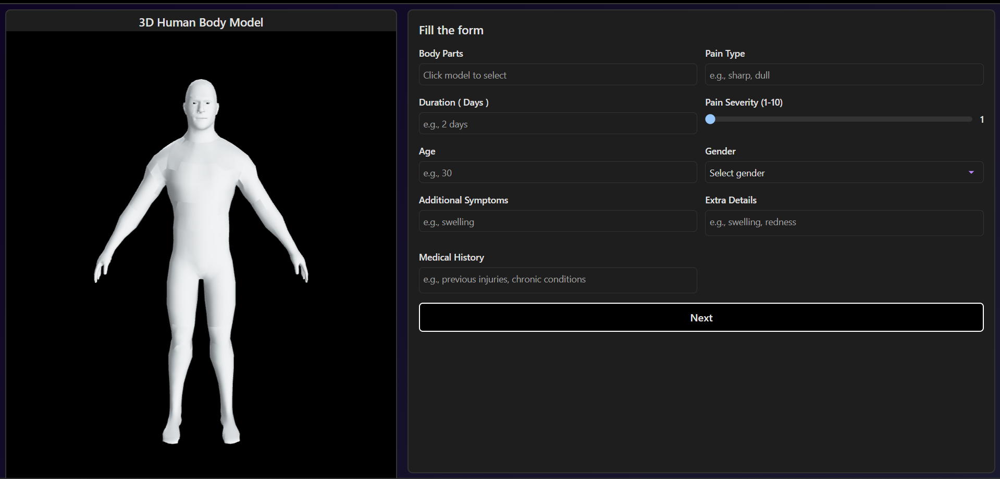
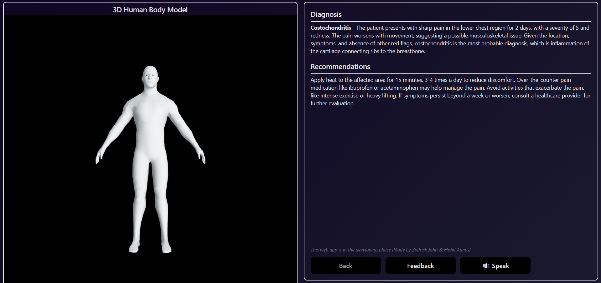
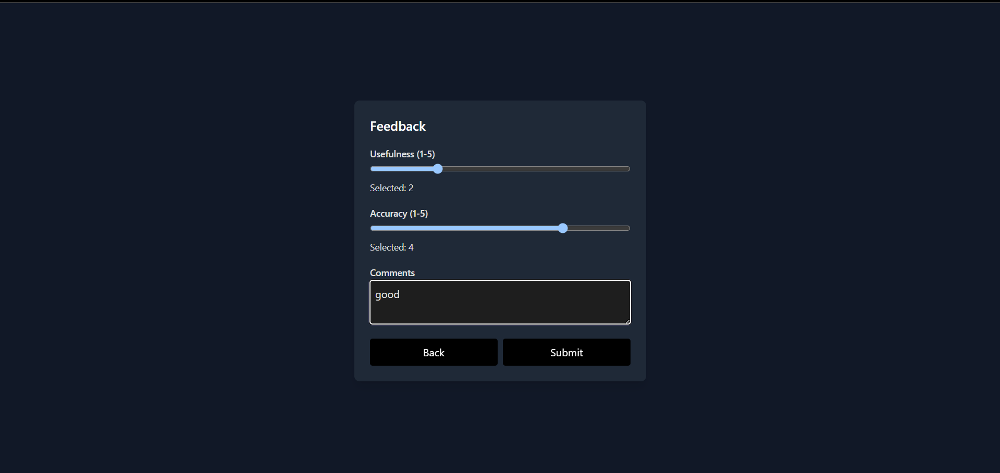

# WellBot.AI

## Introduction

WellBot.AI is an intelligent web application designed to diagnose health issues based on user descriptions of pain and other symptoms. With advanced AI models and a 3D human body integration, users can interact with specific areas of the body to pinpoint their symptoms and get tailored suggestions for possible health concerns.











## Features

- **3D Human Body Integration**: Users can select specific points on a 3D human body model where they feel pain. This interactive feature allows for precise symptom descriptions.
- **Pain Type**: Users can describe the type of pain (sharp, dull, throbbing, etc.) they are experiencing.
- **Pain Duration**: Specify how long the pain has been occurring (e.g., minutes, hours, days).
- **Pain Severity**: Users can rate the severity of the pain on a scale (e.g., mild, moderate, severe).
- **Age and Gender**: These factors help in providing personalized diagnostic suggestions.
- **Additional Symptoms**: Users can list any other symptoms they are experiencing alongside the pain.
- **Extra Details**: Users can provide any additional information relevant to the diagnosis.
- **Medication History**: Optionally, users can include details about any medications they are currently taking or have taken in the past.

## Installation / Run Locally

To run WellBot.AI locally on your system, follow these steps:
### 1. Clone the Repository

```bash
git clone [REPOSITORY_URL]
cd WellBot.AI
```

### 2. Install Backend Dependencies

```bash
cd backend
pip install -r requirements.txt
```

### 3. Install Frontend Dependencies

```bash
cd ../frontend
npm install
```

### 4. Environment Variables

```bash
OPENROUTER_API_KEY=[YOUR_API_KEY_HERE]
```

### 5. Start the Application

backend
```bash
cd backend
python app.py
```

frontend
```bash
cd ../frontend
npm start
```

---

WellBot.AI is made with 💖 by Aanas and Zodrick at the HackIndia Hackathon (36 hour) Spark 8, LIET, Greater Noida and preseneted it in its finals on 10th May 2025.
